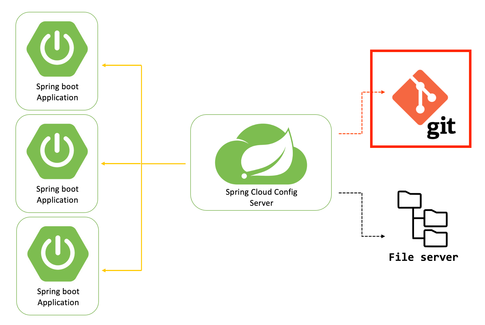

# CONFIG SERVER
Provides support for externalized configuration in a distributed system.

The configurations can be defined in the:
- classpath: /resources/config
- specific directory
- reposiitory git

This example have configuration in application.yml and config of development environment, qa environment and
prod environment. In this case contains the configuration of database and sensitive information has encrypted.
The configuration get from git repository specified. [config_server](git@github.com:ugarciacalderon/config.git).

To connect to database located in aws is required this property in Config Server Application starter
- @SpringBootApplication(exclude = {DataSourceAutoConfiguration.class})

The repository properties can be encrypted so as not to expose sensitive information, Spring Cloud Config Server
will decrypt them internally.

Available endpoints
- http://localhost:8071/encrypt
- http://localhost:8071/decrypt

Official Documentation

[Spring Cloud Config](https://docs.spring.io/spring-cloud-config/docs/current/reference/html/)
[Spring Cloud Config Server](https://docs.spring.io/spring-cloud-config/reference/server.html)

